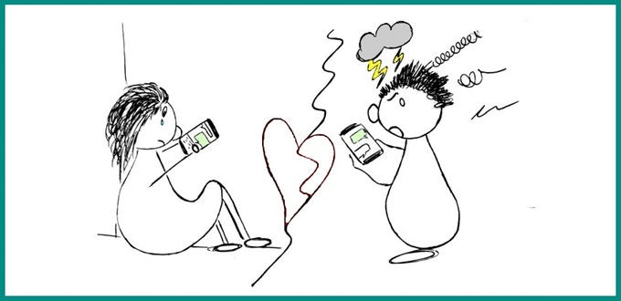
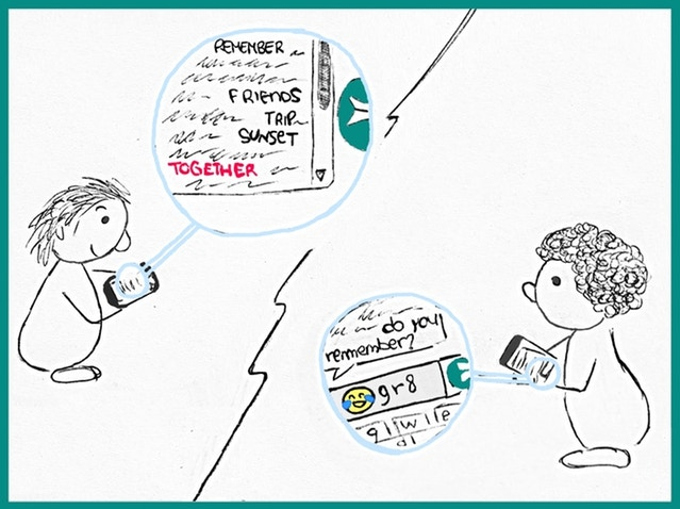
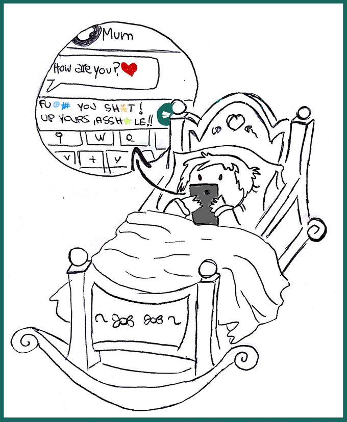
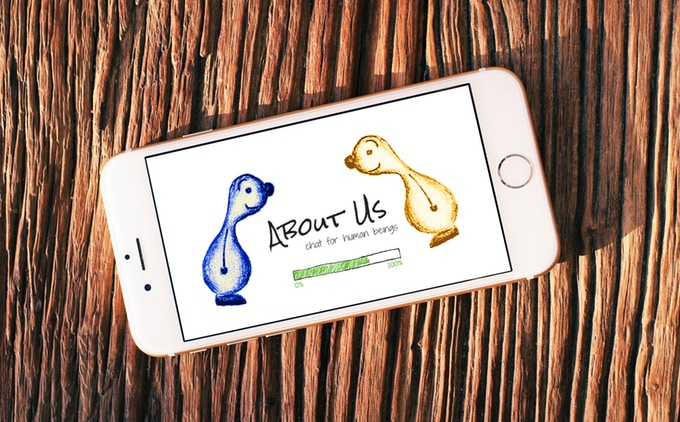

### su di noi, sui nostri sentimenti, i nostri pensieri, piani, desideri...

Le piattaforme di comunicazione cambiano velocemente: all'inizio c'erano i semplici SMS, poi sono arrivate le emoticon, oggi GIF e video divertenti traboccano dalle nostre conversazioni. È sufficiente una rapida occhiata per notare come il contenuto unico, autentico, che parla veramente 'di noi', stia sparendo anche dalle conversazioni con le persone a cui teniamo di più. 

## E adesso?
Siamo convinti che le piattaforme chat 'moderne' tendano a sopprimere il bisogno naturale di esprimere noi stessi e lo rimpiazzino con l'impulso a condividere contenuti virali, preconfezionati in modo standardizzato. Senza contare l'uso sovrabbondante di slang e linguaggio scarno, scialbo e volgare! Il meccanismo è trascinante: nessuno negherà che l'ultima GIF che gli hai inviato fa morire dal ridere...

È per questo che vogliamo costruire una piattaforma di chat che ci aiuti a parlare di noi, a focalizzarci sulle nostre relazioni e che incoraggi l'introspezione. Non vogliamo che le persone si trasformino in propagatori semi-automatici di meme!

Questa campagna è essa stessa un esperimento sociale: le persone vogliono prendere una posizione su come debbano funzionare le loro comunicazioni tramite chat o preferiscono che siano altri (e i lori interessi) a deciderlo?

## Concretamente parlando
Vogliamo costruire una nuova piattaforma chat con caratteristiche uniche: niente foto, video o GIF (ci sono già altri mezzi per condividere quel tipo di contenuti!). AboutUs sarà letteralmente 'su di noi' , sui nostri sentimenti, pensieri, programmi e desideri.

*L'idea: una community autogestita per migliorare le relazioni digitali*

Vorremmo chiedere agli utenti di votare periodicamente (potremmo anche considerare il rilascio dii token di voto sulla blockhain di Ethereum) su ciò che è giusto e sano nelle comunicazioni digitali e cosa è invece sbagliato e tossico. Come conseguenza, nuove regole e caratteristiche verranno aggiunte alla piattaforma e saranno valutate dagli utenti.

In più, ogni nuova conversazione tra due persone potrà essere preceduta da un rapido accordo (guidato dalla piattaforma) tra voi e il vostro interlocutore, riguardante ciò che in quella specifica conversazione vorreste incoraggiare e quali regole vorreste applicare.

## Preservare la ricchezza del linguaggio
Siamo convinti che la messaggistica istantanea ci stia spingendo ad utilizzare parole oltremodo comuni e a formulare frasi sintatticamente errate, portandoci ad un impoverimento della varietà lessicale. È possibile utilizzare tecnologie moderne (come le tecniche di interpretazione del linguaggio naturale e il machine learning) per penalizzare messaggi non creativi, non evocativi e non ispirati (introducendo ad esempio un piccolo ritardo nella consegna)? È quello che vogliamo scoprire.

## Spegnere l'impulsività
Jane ieri ha discusso con Joe e questo litigio le ha spezzato il cuore. Adesso vuole esprimere quello che prova relativamente alla discussione e per farlo sceglie attentamente ogni singola parola. Quando Joe riceve il messaggio, è ancora 'irritato' e risponde immediatamente mancandole di rispetto. Questo non ci piace: vogliamo che Jane possa fare in modo che Joe debba attendere almeno tre minuti prima di rispondere a quel messaggio (e speriamo che nel frattempo ci pensi bene!).

 
## Tester di empatia
Hai presente quando mandi a Jack un messaggio di 400 parole ricordando un bel momento dei vecchi tempi e tutto quello che ti torna indietro è “ahah già”?

Bene, ci piacerebbe stimare automaticamente l'intensità di vita di un messaggio e chiedere a Jack se vuole davvero rispondere con indifferenza oppure se è soltanto di fretta ma gli andrebbe di mettere più contenuto nel suo messaggio.

 
## Contro la dipendenza da smartphone
Molti studi neuroscientifici stanno indagando gli effetti dannosi del flusso continuo di notifiche sulla capacità di concentrazione e sulla nostra creatività. Vogliamo che le persone possano decidere, ad esempio, se ricevere le notifiche immediatamente o una volta all'ora.

Pensiamo che sia una violazione di libertà la scelta di alcune piattaforme di costringerti ad usare l'amato-odiato smartphone per poter comunicare con i tuoi cari. Da progetto, AboutUs sarà multi-piattaforma (incluso il browser): pensiamo che usare quell'amato/odiato dispositivo che sta sempre nella tua tasca per comunicare con i tuoi cari sia semplicemente una violazione di libertà.

Le spunte di lettura, l'informazione “Bob sta scrivendo..” e l'ora di ultimo accesso saranno funzionalità configurabili a livello generale ma anche a livello di singola conversazione.

## Auto-educazione
AboutUs è salutare ad ogni età. I giovani e gli adulti possono preservare e rinforzare le competenze comunicative già acquisite, ma non solo... AboutUs ha anche uno scopo educativo per bambini e adolescenti, che possono sentirsi stimolati a sviluppare capacità linguistiche e di auto-espressione.

Speriamo anche che AboutUs possa aiutare ad evitare situazioni come queste:

 
## Regole in progress 
Ci siamo chiesti come usare il concetto che per noi sta alla base di AboutUs per migliorare lo strumento chat. Abbiamo deciso che la cosa migliore è lasciare gli utenti liberi di scegliere, quando vogliono, il set di regole che preferiscono. Perchè non impostare, ad esempio, un limite giornaliero all'invio di messaggi brevi/estremamente brevi per auto-incoraggiare una piena espressione di noi stessi?

## Business model
Spiacenti, in questo progetto non c'è un business model. Pensiamo che le relazioni interpersonali siano troppo importanti e delicate per trasformarle in business. Rilasceremo AboutUs con quanto raccolto durante questa campagna (la app sarà gratis) e poi andremo avanti con le donazioni (dopotutto, una piattaforma di comunicazione puramente testuale non dovrebbe essere troppo costosa da mantenere..).

*AboutUs sarà una community, non un prodotto commerciale!*

Sei uno sviluppatore software, un grafico, un esperto di UX, un insegnante, un psicologo, un critico dei social media, un libero pensatore? Se vuoi giocare un ruolo in questo progetto o ti va di dirci cosa ne pensi, ci farebbe piacere sentirti!

 
## Sfide

Siamo studenti a tempo pieno nel campo dell'Ingegneria Informatica. Abbiamo sviluppato un buon set di competenze tecniche e ci appassiona l'idea di creare nuove tecnologie per le persone.

[Sara](https://www.linkedin.com/in/sara-marullo-50606a106/), dopo aver conseguito una laurea con lode in Fisica, si vuole concentrare sulle tecnologie che vedono l'uomo protagonista, spaziando dalla robotica indossabile alle interazioni umane mediate dalla tecnologia.

[Simone](https://www.linkedin.com/in/simone-marullo-27664b106/) è uno studente ventunenne di Ingegneria informatica. Ha iniziato a giocare con il codice da bambino; adesso è interessato alle piattaforme di decentralizzazione, machine learning e tecnologie web.

